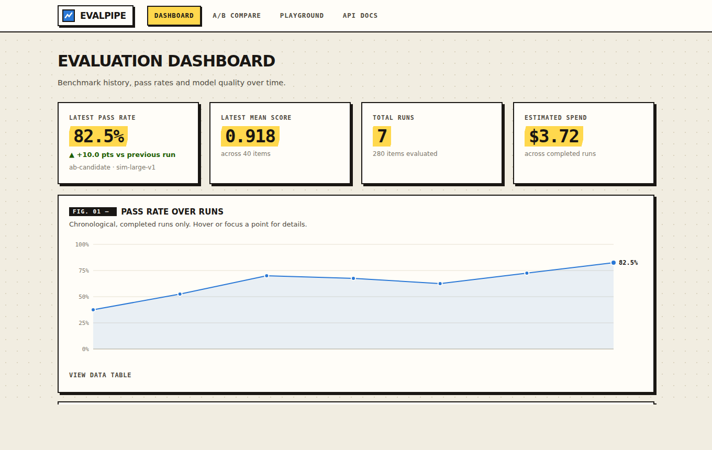
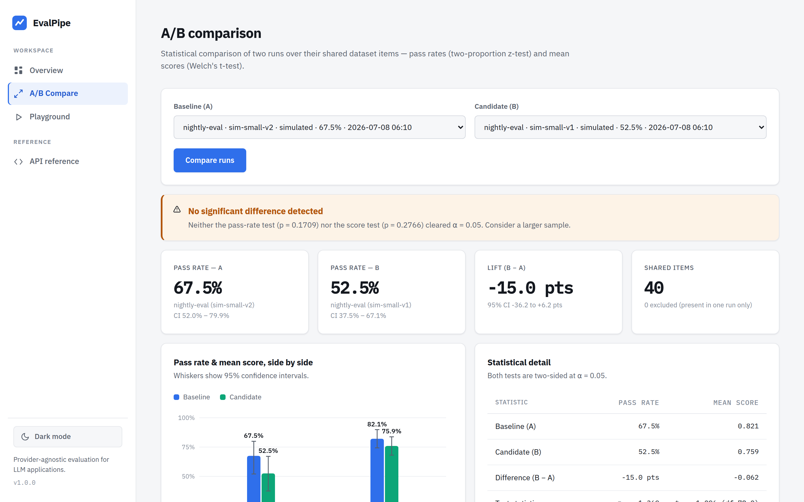
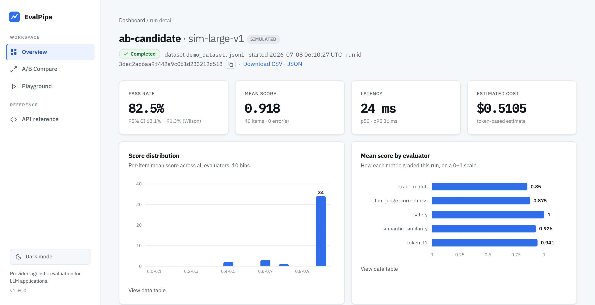
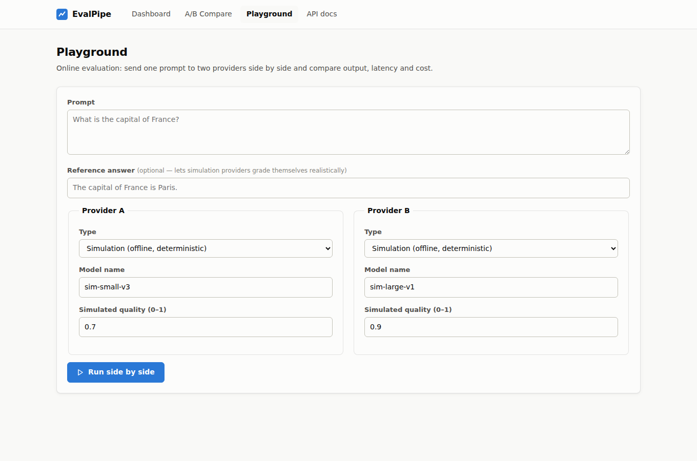
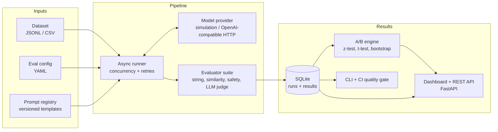

# EvalPipe — AI Evaluation Pipeline

[](https://github.com/PerinbaBuilds/AI-Evaluation-Pipeline/actions/workflows/ci.yml)


A **provider-agnostic evaluation pipeline for LLM applications**: batch benchmarks, a
pluggable metric suite, statistically rigorous A/B testing, prompt versioning, and a
reporting dashboard — all self-hosted, dependency-light, and runnable fully offline.

Evaluating LLM output is the unit test of the generative-AI lifecycle: before shipping a
new model or prompt, you need evidence it is actually better. EvalPipe automates that
loop end to end — run a dataset through a model, score every output, store the results,
and answer the question that matters: *"is the candidate significantly better than the
baseline, or is the difference just noise?"*

| Dashboard | A/B comparison |
|---|---|
|  |  |

| Run detail | Playground |
|---|---|
|  |  |

## Features

- **Batch evaluation pipeline** — async runner with bounded concurrency, exponential-backoff
  retries, and per-item failure isolation (one bad item never sinks a run).
- **Six pluggable evaluators** — exact match, SQuAD-style token F1, contains/regex,
  lexical semantic similarity, a safety blocklist, and LLM-as-a-judge with built-in
  *correctness*, *faithfulness* (RAG) and *relevance* rubrics.
- **Real statistics, implemented from first principles** — two-proportion z-tests,
  Welch's t-test (incomplete beta via Lentz's continued fraction), Wilson intervals,
  bootstrap CIs, Cohen's *h*/*d* effect sizes, and a power/sample-size calculator.
  Zero numeric dependencies; every function is verified against published table values.
- **Honest A/B verdicts** — runs are paired by item id, tested at a configurable α, and
  small samples produce explicit *underpowered* warnings instead of false confidence.
- **Item-level regression diff** — the A/B view names exactly which items flipped
  pass→fail (regressions) vs fail→pass (improvements), the failures an aggregate hides.
- **Subgroup (slice) analysis** — break a run's pass rate down by a dataset metadata
  field (topic, difficulty, language, …) with per-group Wilson intervals, so a 50%
  overall resolves into "95% on easy, 20% on hard" and you see *where* the model is weak.
- **Response cache** — opt-in memoisation of model outputs by `(model, prompt)`, so you
  can iterate on metrics and thresholds and re-score for free without re-running inference.
- **Export & observability** — download any run's results as CSV/JSON, and scrape
  aggregate counters from a Prometheus `/metrics` endpoint.
- **Latency & cost tracking** — p50/p95 latency and token-based cost estimates per run,
  so the quality/latency/cost trade-off is visible on one screen.
- **Prompt management** — versioned prompt templates stored alongside results, so every
  run records exactly which prompt produced it.
- **First-class model integrations** — OpenAI (ChatGPT), Anthropic, and Google Gemini,
  plus a generic OpenAI-compatible provider for local runtimes/proxies. API keys are
  read from server-side environment variables — never stored in configs or sent to the
  browser.
- **Real-time comparison** — send one prompt to several models at once and see output,
  latency and cost **and** live per-metric scores from the same evaluator suite the batch
  pipeline uses. The playground shows which integrations are configured at a glance.
- **CI/CD quality gate** — `evalpipe run config.yaml --min-pass-rate 0.85` exits non-zero
  when quality regresses, so evaluations gate deploys like tests do.
- **Deterministic offline demo** — a simulation provider with controllable accuracy makes
  every feature (including the LLM judge) work with no API keys and no network.

## Architecture



The design follows the reference architecture used by cloud-native LLM evaluation
platforms, mapped onto zero-cost, self-hosted equivalents:

| Cloud reference component | EvalPipe equivalent |
|---|---|
| Step Functions batch invocation/evaluation workflows | `asyncio` runner with bounded concurrency and retries |
| Managed prompt management service | Versioned prompt registry in SQLite (`evalpipe prompt ...`) |
| S3 + Athena results store | SQLite with indexed run/result tables |
| Hosted evaluation libraries (accuracy, similarity, toxicity metrics) | Built-in evaluator suite, dependency-free |
| RAG evaluation metrics (faithfulness, relevancy) | LLM-judge rubrics grading against item context |
| Latency/throughput benchmarking | Per-run p50/p95 latency + token-cost estimates |
| Side-by-side model comparison UI on Fargate | FastAPI dashboard + playground in a single Docker container |

## Quickstart

```bash
git clone https://github.com/PerinbaBuilds/AI-Evaluation-Pipeline.git
cd AI-Evaluation-Pipeline
python -m venv .venv && source .venv/bin/activate
pip install -e .

evalpipe demo     # seed a deterministic offline evaluation history
evalpipe serve    # dashboard at http://127.0.0.1:8000
```

No API keys, no network calls — the demo uses the simulation provider. Open the
dashboard, then try the **A/B Compare** tab with the two run ids `evalpipe demo` printed.

### Or with Docker

```bash
docker compose up --build
# then, inside the container or against the mounted volume:
docker compose exec evalpipe evalpipe demo --db /data/evalpipe.db
```

### One-click cloud deploy

[](https://render.com/deploy?repo=https://github.com/PerinbaBuilds/AI-Evaluation-Pipeline)

Render reads [`render.yaml`](render.yaml), builds the Docker image, and serves it
at a public HTTPS URL. `EVALPIPE_SEED_DEMO=1` seeds the offline demo history on
first boot, so the dashboard has data the moment the link opens.

## Running an evaluation

An evaluation run is described declaratively:

```yaml
# eval.yaml
name: qa-baseline
dataset: examples/qa_dataset.jsonl      # JSONL or CSV

provider:
  type: openai_compatible               # works with vLLM, Ollama, llama.cpp, hosted APIs
  model: my-model
  base_url: http://localhost:11434/v1
  api_key_env: MY_PROVIDER_API_KEY      # env var NAME — secrets never live in configs

prompt_template: |
  Answer accurately and concisely.

  Question: {prompt}

evaluators:
  - type: token_f1
    threshold: 0.6
  - type: semantic_similarity
    threshold: 0.5
  - type: llm_judge
    rubric: correctness
    threshold: 0.7

concurrency: 8
retries: 2
```

```bash
evalpipe validate examples/qa_dataset.jsonl   # check the dataset first
evalpipe run eval.yaml                        # run + persist
evalpipe runs                                 # list stored runs
evalpipe compare <baseline_id> <candidate_id> # statistical A/B report
```

An item **passes** when every configured evaluator meets its threshold. Datasets are
validated strictly up front — malformed rows fail with line numbers rather than being
silently dropped, because a silently truncated dataset invalidates every metric
downstream.

### Evaluators

| Type | What it measures | Notes |
|---|---|---|
| `exact_match` | Normalised string equality | case/punctuation options |
| `token_f1` | SQuAD-style bag-of-tokens F1 | partial credit for QA |
| `contains` | Required substrings (`any`/`all`) | falls back to `expected` |
| `regex` | Pattern presence | validated at config time |
| `semantic_similarity` | Cosine over TF-weighted word uni+bigrams | dependency-free |
| `safety` | Blocklist screen | brand safety / PII markers |
| `llm_judge` | Grader model scores 0–10 against a rubric | `correctness`, `faithfulness`, `relevance`, or custom |

### A/B testing

`evalpipe compare` pairs the two runs by item id and runs two two-sided tests:

- **Pass rate** (primary): two-proportion z-test, Wilson score intervals, Cohen's *h*
- **Mean score** (secondary): Welch's t-test, bootstrap CI on the difference, Cohen's *d*

The verdict is `candidate_better` / `baseline_better` / `inconclusive` at your α
(default 0.05). Below 30 shared items the report warns that the tests are underpowered —
and `evalpipe.stats.required_sample_size_two_proportions()` tells you how many items you
need to detect a given lift.

### Model providers

| `type` | Talks to | Cost | API key env var |
|---|---|---|---|
| `mock` | Deterministic offline simulation | free | — |
| `ollama` | Local models via Ollama | free (local) | — |
| `gemini` | Google Gemini `generateContent` | free tier | `GEMINI_API_KEY` |
| `groq` | Groq (fast hosted open models) | free tier | `GROQ_API_KEY` |
| `openrouter` | OpenRouter (incl. `:free` models) | free models | `OPENROUTER_API_KEY` |
| `openai` | OpenAI Chat Completions (ChatGPT) | paid | `OPENAI_API_KEY` |
| `anthropic` | Anthropic Messages API | paid | `ANTHROPIC_API_KEY` |
| `openai_compatible` | Any other OpenAI-style endpoint (vLLM, proxies) | varies | configurable |

**Free ways to try real models:** run [Ollama](https://ollama.com) locally (no key), or grab a
free key from [Google AI Studio](https://aistudio.google.com/apikey) (Gemini),
[Groq](https://console.groq.com) or [OpenRouter](https://openrouter.ai) and pick a `:free` model.

Set the relevant key in the environment before starting the server, then pick the
provider (and enter a model id) in the **Playground**, or reference it in a run config.
Keys are resolved server-side at call time and never leave the process.

```bash
export OPENAI_API_KEY=sk-...
export ANTHROPIC_API_KEY=sk-ant-...
export GEMINI_API_KEY=...
evalpipe serve
```

### Gating CI/CD on quality

```yaml
# in your application's pipeline
- name: Regression-check the model
  run: evalpipe run eval.yaml --min-pass-rate 0.85
```

Exit codes: `0` pass, `1` quality gate failed, `2` configuration/dataset error.

## REST API

Interactive OpenAPI docs at `/docs` when serving. Highlights:

| Endpoint | Description |
|---|---|
| `GET /api/health` | health/version probe (used by the Docker healthcheck) |
| `GET /metrics` | Prometheus exposition of aggregate counters |
| `GET /api/runs` · `GET /api/runs/{id}` | run history and summaries |
| `GET /api/runs/{id}/results` | per-item results, filterable by outcome |
| `GET /api/runs/{id}/export?format=csv\|json` | download a run's results |
| `GET /api/runs/{id}/slices?key=<field>` | pass rate broken down by a metadata field |
| `POST /api/runs` | launch an evaluation (validated up front, executed in background) |
| `GET /api/compare?baseline=&candidate=` | full statistical comparison + regression diff |
| `POST /api/playground` | one prompt against up to four providers, side by side |
| `GET/POST /api/prompts` | versioned prompt templates |

## Development

```bash
pip install -e ".[dev]"
pytest --cov            # 216 tests, ~96% coverage
ruff check . && ruff format --check .
mypy                    # strict mode
```

CI runs lint + strict typing, the test matrix on Python 3.11/3.12 with a coverage gate,
and a Docker build with a live smoke test against `/api/health`.

### Project layout

```
src/evalpipe/
├── datasets.py        # strict JSONL/CSV loading + validation
├── config.py          # pydantic configs (discriminated unions, fail-fast)
├── providers/         # simulation provider + OpenAI-compatible HTTP client
├── evaluators/        # metric suite + LLM judge
├── stats.py           # z/t tests, intervals, bootstrap, power — from scratch
├── ab.py              # paired A/B comparison + verdicts
├── runner.py          # async orchestration
├── pipeline.py        # config → run → persist, shared by CLI and API
├── storage.py         # SQLite: runs, results, prompt registry
├── cli.py             # typer CLI with CI-friendly exit codes
└── server/            # FastAPI app, dashboard templates, SVG chart engine
```

### Design notes

- **Why SQLite?** Zero-ops persistence with WAL journaling covers this workload
  comfortably; the storage layer is a thin repository class that could be swapped for
  Postgres without touching callers.
- **Why hand-rolled statistics?** The maths is the core of a trustworthy A/B verdict.
  Implementing it directly (and testing against published t-table/z-table values) keeps
  the dependency tree tiny and the behaviour auditable.
- **Why a simulation provider?** Deterministic, quality-controllable model behaviour
  makes the entire system testable in CI, demoable offline, and honest about how metrics
  behave across the quality spectrum.
- **Accessibility** — the dashboard is WCAG-AA-minded: 4.5:1 text contrast, visible
  focus states, keyboard-reachable chart marks with the same tooltip as hover, a data
  table twin behind every chart, and `prefers-reduced-motion` respected.

## License

[MIT](LICENSE) © 2026 Perinba Athiban
