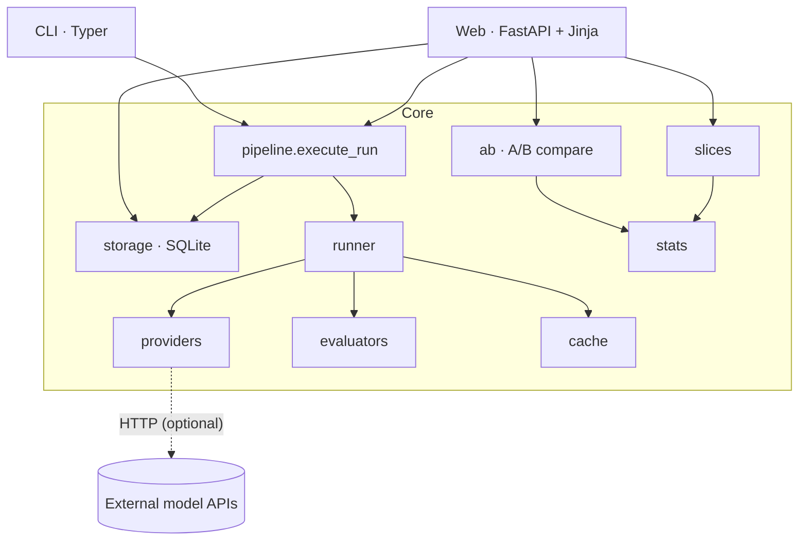
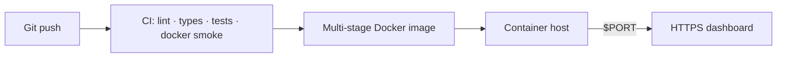

# Software Design Specification (SDS)

**Project:** EvalPipe — Provider‑Agnostic Evaluation Pipeline for LLM Applications
**Document version:** 1.0
**Companion document:** `docs/SRS.md`

---

## 1. Introduction

### 1.1 Purpose
This document describes the architecture and detailed design of EvalPipe: its layers, modules, data model, key algorithms, interfaces, and the rationale behind the significant decisions. It is the implementation‑level counterpart to the requirements in `docs/SRS.md`.

### 1.2 Audience
Engineers extending or reviewing the system, and operators deploying it.

### 1.3 Design goals
Correctness (especially of statistics), zero heavy dependencies for the core, testability without network access, security of secrets, and a clean, layered separation that keeps the web layer thin.

---

## 2. Architectural Overview

EvalPipe is a **layered monolith**. Dependencies point inward: the web and CLI layers depend on the core; the core depends on nothing external at import time.



**Layer responsibilities**

| Layer | Package(s) | Responsibility |
|---|---|---|
| Presentation | `server/` (FastAPI, Jinja, static) | HTTP routing, HTML rendering, request/response schemas. |
| Application | `pipeline.py`, `cli.py`, `demo.py` | Orchestrate a run; command entry points; demo seeding. |
| Domain | `runner.py`, `evaluators/`, `providers/`, `ab.py`, `slices.py`, `stats.py` | Execution, grading, model access, statistics. |
| Data | `storage.py`, `cache.py` | Durable persistence and memoisation. |
| Cross‑cutting | `config.py`, `exceptions.py`, `datasets.py` | Validation, typed errors, IO. |

---

## 3. Technology Stack

| Concern | Choice | Why |
|---|---|---|
| Language | Python 3.11 / 3.12 | Modern typing, `asyncio`. |
| Web | FastAPI + Starlette, Jinja2 | Async, typed, server‑rendered. |
| Validation | Pydantic v2 (discriminated unions, `extra="forbid"`) | Fail‑fast, self‑documenting config. |
| HTTP client | httpx (async, injectable transport) | Testable provider calls. |
| Persistence | SQLite (WAL) via stdlib `sqlite3` | Zero‑ops, durable, portable. |
| Statistics | Hand‑implemented (no NumPy/SciPy) | Correctness owned in‑repo; tiny footprint. |
| CLI | Typer | Ergonomic commands, env‑var binding. |
| Charts / UI | Self‑authored SVG, vanilla JS, IBM Plex (self‑hosted) | No CDN, offline‑capable, accessible. |
| Packaging | Hatchling, Docker (multi‑stage) | Reproducible wheel and image. |
| Quality | ruff, mypy (strict), pytest + coverage | Enforced in CI. |

---

## 4. Component (Module) Design

### 4.1 `config.py` — configuration & validation
Pydantic models with a **discriminated union** on `type` for providers and evaluators, so a typo fails before any model is called. `EvalConfig` is the top‑level run description (dataset, provider, evaluators, concurrency, retries, caching, optional prompt template). `load_config()` parses YAML/JSON, returns a precise located error on failure, and **rejects inline API keys** in files (`_reject_inline_keys`).

### 4.2 `datasets.py` — dataset IO
Loads JSONL into immutable `DatasetItem(id, prompt, expected?, metadata)` records with validation and clear errors on malformed lines.

### 4.3 `providers/` — model access
`ModelProvider` is the abstract interface: `async generate(prompt, reference?) -> ModelResponse` plus `estimate_cost_usd` and `aclose`. Implementations:
- `mock.MockProvider` — deterministic simulator (see §6.4).
- `openai_compat.OpenAICompatibleProvider` — OpenAI chat‑completions wire format; also backs the OpenAI/Groq/OpenRouter/Ollama presets.
- `anthropic.AnthropicProvider`, `gemini.GeminiProvider` — native wire formats.

`build_provider(config)` maps a validated config to an implementation and resolves the API key **inline‑first, then environment variable** (`_resolve_key`). All HTTP providers accept an injectable `transport` for tests.

### 4.4 `evaluators/` — grading
`Evaluator` interface: `async evaluate(item, output) -> EvalVerdict(name, score∈[0,1], passed, detail)`. Implementations in `string_metrics.py` (exact match, token‑F1, contains, regex), `semantic.py` (dependency‑free TF‑weighted cosine over word uni/bi‑grams), `safety.py` (blocklist), and `llm_judge.py` (grader model + rubric). `build_evaluators(configs, provider)` constructs the suite.

### 4.5 `runner.py` & `pipeline.py` — execution
`runner` executes one item: render prompt → call provider (with retries/backoff) → grade with all evaluators → produce an `ItemResult`. `pipeline.execute_run` fans items out under an `asyncio.Semaphore`, aggregates run‑level metrics (pass rate, mean score, per‑evaluator means, latency percentiles, cost), and writes everything to storage. Failures are isolated per item.

### 4.6 `ab.py` — A/B comparison
Aligns two runs on their **shared item ids**, computes the pass‑rate z‑test and mean‑score Welch t‑test, effect sizes, confidence intervals, a bootstrap CI, and an **item‑level diff** (`regressed_ids`, `improved_ids`) — the regressions an aggregate pass rate hides.

### 4.7 `slices.py` — subgroup analysis
Groups a run's `ItemResult`s by a metadata key and reports per‑group `n`, pass rate, Wilson CI, and mean score.

### 4.8 `stats.py` — statistics (see §6)
Self‑contained inferential statistics used by `ab.py` and `slices.py`.

### 4.9 `storage.py` — persistence
SQLite with WAL, a fixed schema (§5), typed row mappers (`RunRecord`, `ItemResult`, `PromptRecord`), and idempotent additive migrations. Also derives each run's `provider_type` from stored config so the UI can flag simulated runs.

### 4.10 `cache.py` — response cache
Optional memoisation of `(model, prompt)` → output so metric‑only re‑runs skip inference; sound only for deterministic decoding.

### 4.11 `server/` — presentation
`app.create_app(db_path)` builds the FastAPI app: REST endpoints, server‑rendered pages, static mount with an mtime‑based cache‑busting asset version, and background execution of runs created over HTTP. `schemas.py` holds request/response models. Templates render charts as inline SVG with server‑rendered table twins.

---

## 5. Data Design

SQLite, WAL mode. Tables:

```
runs(id PK, name, model, dataset, status CHECK(running|completed|failed),
     config_json, started_at, finished_at?, error?,
     item_count, error_count, pass_rate, mean_score, total_cost_usd,
     latency_p50_ms, latency_p95_ms, evaluator_means)

results(run_id FK->runs, item_id, prompt, expected?, output, passed,
        mean_score, scores(json), latency_ms, cost_usd, attempts, error?,
        metadata(json), PRIMARY KEY(run_id,item_id))

prompts(name, version, content, created_at)          -- versioned prompt store
response_cache(key PK, model, output, input_tokens, output_tokens, created_at)
```

Design notes: JSON columns (`config_json`, `scores`, `metadata`, `evaluator_means`) keep the schema stable while carrying rich structure; `results` is indexed by `run_id`; secrets are never stored (config JSON excludes inline keys by construction).

---

## 6. Detailed Design of Key Algorithms

### 6.1 Student‑t CDF via the regularized incomplete beta
The two‑sided t p‑value uses the regularized incomplete beta function `I_x(a,b)`, evaluated with the **Lentz continued‑fraction** method (`_betacf`) for numerical stability. This avoids any external special‑functions library while matching SciPy to 1×10⁻⁸ (verified).

### 6.2 Welch's t‑test
Computes the t‑statistic from the difference of means over the unequal‑variance standard error, with the **Welch–Satterthwaite** degrees of freedom, then the two‑sided p via §6.1. Degenerate inputs (zero variance, identical samples) are handled explicitly.

### 6.3 Two‑proportion z‑test, Wilson interval, effect sizes, bootstrap
- **z‑test:** pooled standard error; p from the normal CDF (Abramowitz–Stegun approximation), cross‑checked against SciPy.
- **Wilson interval:** score interval for a binomial proportion (preferred over the normal approximation at small n).
- **Effect sizes:** Cohen's h (arcsine‑transformed proportions) and Cohen's d.
- **Bootstrap:** resampled CI for the mean‑score difference; **required sample size** estimator for two proportions.

### 6.4 Deterministic simulator (`MockProvider`)
The simulator seeds a PRNG from `(model, prompt, seed)` and draws a value `r`. If `r < quality` it returns the reference verbatim; otherwise it degrades or replaces the answer. Consequences: identical `(model, prompt, seed)` ⇒ identical output (reproducible tests); different `quality` ⇒ a stronger/weaker "model"; the model name is part of the key, so distinct models behave distinctly. This gives realistic, controllable data with no network or cost.

### 6.5 Semantic similarity (dependency‑free)
Cosine similarity over TF‑weighted word unigrams + bigrams — a lexical proxy that needs no embedding model, keeping the core offline and fast.

---

## 7. Interface Design — REST API

| Method & path | Purpose |
|---|---|
| `GET /api/health` | Health/version probe (used by the container healthcheck). |
| `GET /api/runs` | Paginated run list. |
| `GET /api/runs/{id}` | Run detail. |
| `GET /api/runs/{id}/results` | Per‑item results (filterable by pass/fail). |
| `GET /api/runs/{id}/slices` | Subgroup breakdown by metadata. |
| `GET /api/runs/{id}/export` | Export CSV or JSON. |
| `POST /api/runs` | Create a run (executes as a background task; returns `202`). |
| `GET /api/compare` | A/B comparison of two runs (tests, effect sizes, item diff). |
| `GET /api/integrations` | Provider configuration status. |
| `POST /api/playground` | Real‑time multi‑provider comparison, scored live. |
| `GET /api/prompts`, `POST /api/prompts` | Versioned prompt management. |
| `GET /metrics` | Prometheus exposition. |
| `GET /`, `/compare`, `/playground`, `/runs/{id}` | Server‑rendered pages. |

Requests and responses are Pydantic‑validated; errors return appropriate status codes (`400` bad input, `404` unknown resource, `422` validation).

---

## 8. Concurrency & Error Handling

- **Concurrency:** items run under an `asyncio.Semaphore(concurrency)`; runs created via HTTP execute as tracked background tasks so the row appears immediately as *running*.
- **Retries:** provider calls retry with exponential backoff up to `retries`.
- **Isolation:** a per‑item try/except records the failure on that `ItemResult` and continues; a per‑provider failure in the playground is confined to its column.
- **Typed errors:** `exceptions.py` defines `EvalPipeError` and subtypes (`ConfigError`, `ProviderError`, `StorageError`) so the web layer can map failures to status codes cleanly.

---

## 9. Security Design

- **Key handling:** keys are resolved at call time, inline‑first then environment variable; inline keys carry `exclude=True`/`repr=False` so they never serialise, log, or return, and `load_config` refuses files that contain them.
- **Least privilege:** the Docker image runs as a non‑root `evalpipe` user.
- **No third‑party exfiltration:** no CDN or external asset fetches; all static content is self‑hosted.
- **Transport:** external provider calls use HTTPS with explicit timeouts.

---

## 10. Deployment Architecture



- **Image:** multi‑stage build — a builder stage produces a wheel; the slim runtime installs it, drops to a non‑root user, exposes `8000`, and binds `${PORT}` so any platform (Koyeb, Render, Cloud Run, Fly) can inject its port. A container `HEALTHCHECK` hits `/api/health`.
- **First‑boot demo:** `EVALPIPE_SEED_DEMO=1` seeds the offline history when the database is empty, so a fresh deployment is never blank; seeding is idempotent (skipped when runs already exist).
- **State:** SQLite lives on the container filesystem; on ephemeral free tiers it is reseeded on boot. Durable state would use a mounted volume.
- **CI/CD:** GitHub Actions runs lint/format, mypy strict, the test matrix (3.11/3.12) with a coverage gate, and a Docker build + live smoke test on every push.

---

## 11. Key Design Decisions & Rationale

| Decision | Rationale | Trade‑off accepted |
|---|---|---|
| Statistics from scratch (no SciPy) | Own correctness in‑repo; keep the footprint tiny; make the maths reviewable. | More code to test — mitigated by SciPy cross‑validation in verification. |
| SQLite over a server DB | Zero‑ops, durable, portable, ideal for single‑node. | Not built for high‑concurrency multi‑writer loads. |
| Server‑rendered UI + inline SVG | Works without JS; no CDN; fast first paint; accessible table twins. | More template work than a SPA. |
| Discriminated‑union configs | Fail fast with precise errors; self‑documenting. | Verbose model definitions. |
| Deterministic simulator | Offline demos, reproducible tests, no cost. | Simulated, not real, outputs (clearly labelled as such in the UI). |
| Inline‑key playground with file‑key rejection | Frictionless "try it now" without persisting secrets. | Requires careful non‑persistence guarantees (enforced and tested). |

---

## 12. Testing Strategy (design view)

- **Unit** tests per module (config, datasets, providers, evaluators, runner, stats, storage, slices, cache, ab).
- **Integration / black‑box** tests drive the ASGI app through its HTTP surface (`tests/test_api.py`) and an end‑to‑end sweep of every endpoint.
- **Statistical validation:** core methods are cross‑checked against SciPy to 1×10⁻⁸ during verification (SciPy is not a project dependency).
- **Determinism:** identical simulator configuration yields identical output.
- **Gates:** ruff, mypy strict, and an ≥85% coverage floor, all enforced in CI, plus a Docker build with a live health smoke test.

---

*This design document is maintained alongside the code; when a module's contract changes, update the corresponding section here and the requirement it satisfies in `docs/SRS.md`.*
