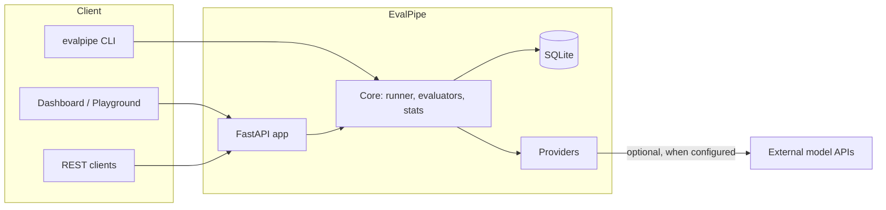

# Software Requirements Specification (SRS)

**Project:** EvalPipe — Provider‑Agnostic Evaluation Pipeline for LLM Applications
**Document version:** 1.0
**Status:** Baseline
**Standard:** Structured after IEEE Std 830‑1998

---

## 1. Introduction

### 1.1 Purpose
This document specifies the functional and non‑functional requirements for **EvalPipe**, a self‑hostable pipeline that benchmarks and statistically compares Large Language Model (LLM) outputs. It is intended for developers, reviewers, and evaluators of the system, and serves as the agreed baseline against which the implementation and its tests are verified.

### 1.2 Scope
EvalPipe ingests a dataset of prompts with expected answers, runs them through one or more model providers, grades the outputs with a configurable suite of evaluators, persists the results, and reports them through a REST API and a server‑rendered dashboard. It performs **rigorous A/B comparison** of two runs using classical statistical tests (implemented from first principles) and supports **real‑time, ad‑hoc comparison** of live providers.

In scope:
- Declarative, validated run configuration (YAML/JSON).
- Multiple model providers (offline simulator, OpenAI‑compatible endpoints, OpenAI, Anthropic, Google Gemini, Groq, OpenRouter, Ollama).
- A metric suite (exact match, token‑F1, contains, regex, semantic similarity, safety, LLM‑as‑judge).
- Concurrent, fault‑tolerant execution with retries and optional response caching.
- Statistical A/B testing, subgroup ("slice") analysis, CSV/JSON export, and Prometheus metrics.
- A dashboard, an A/B comparison view, and a real‑time comparison playground.

Out of scope:
- Training or fine‑tuning models.
- Managing GPU infrastructure.
- Long‑term multi‑tenant data warehousing.

### 1.3 Definitions, Acronyms, and Abbreviations
| Term | Meaning |
|---|---|
| **Provider** | An implementation that turns a prompt into text (real API or offline simulator). |
| **Evaluator / Metric** | A scorer producing a `[0,1]` score and pass/fail verdict for an output. |
| **Run** | One execution of a dataset through a provider with a set of evaluators. |
| **Item** | A single dataset record: prompt, optional expected answer, optional metadata. |
| **A/B test** | A statistical comparison of two runs over their shared items. |
| **Slice** | A subgroup of items grouped by a metadata field (e.g. topic, difficulty). |
| **Wilson interval** | A binomial proportion confidence interval. |
| **Welch's t‑test** | A two‑sample t‑test that does not assume equal variances. |
| **SUT** | System Under Test (the provider/model being evaluated). |

### 1.4 References
- IEEE Std 830‑1998, Recommended Practice for Software Requirements Specifications.
- Companion design document: `docs/SDS.md`.
- Project `README.md` and `pyproject.toml`.

### 1.5 Overview
Section 2 gives the overall product context. Section 3 enumerates functional requirements grouped by feature. Section 4 defines external interfaces. Section 5 states non‑functional requirements. Section 6 covers remaining constraints. Requirement identifiers use the form **FR‑x.y** (functional) and **NFR‑x** (non‑functional) so that tests can trace to them.

---

## 2. Overall Description

### 2.1 Product Perspective
EvalPipe is a stand‑alone, self‑contained application. It has no mandatory third‑party services: it can run fully offline using a deterministic simulator, and only reaches the network when a real provider is configured. It is packaged as a Python package (`evalpipe`), a CLI, and a Docker image, and is deployable to any container host.

### 2.2 Product Functions (summary)
- Configure and validate an evaluation run.
- Execute runs concurrently with retries and optional caching.
- Grade outputs with a configurable metric suite.
- Persist runs and per‑item results durably.
- Compare two runs with statistical rigor (pass‑rate and mean‑score tests, effect sizes, confidence intervals, item‑level regression diff).
- Break results down by subgroup (slice analysis).
- Compare live providers in real time from the browser.
- Export results (CSV/JSON) and expose operational metrics.

### 2.3 User Classes and Characteristics
| User class | Description | Primary needs |
|---|---|---|
| **ML/Applied engineer** | Runs evaluations, compares model versions. | Correct metrics, trustworthy statistics, fast iteration. |
| **Reviewer / stakeholder** | Reads dashboards to decide ship/no‑ship. | Clear verdicts, confidence intervals, drill‑down. |
| **Operator / SRE** | Deploys and monitors the service. | Health checks, metrics, reproducible container. |
| **Evaluator / recruiter** | Inspects the codebase and running app. | Clean design, tests, documentation. |

### 2.4 Operating Environment
- **Runtime:** Python 3.11 or 3.12.
- **OS:** Linux, macOS, or Windows (CLI and server); Linux container for deployment.
- **Browser:** Any modern evergreen browser; the UI is server‑rendered and progressively enhanced (works without JavaScript for core reporting).
- **Storage:** Local SQLite database file.

### 2.5 Design and Implementation Constraints
- **CON‑1:** Core statistics MUST be implemented from first principles (no NumPy/SciPy dependency).
- **CON‑2:** No runtime dependency on any CDN; all static assets (CSS, JS, fonts) are self‑hosted.
- **CON‑3:** Secrets (API keys) MUST NOT be stored in configuration files or persisted to the database.
- **CON‑4:** The application MUST run and demonstrate value fully offline (deterministic simulator).
- **CON‑5:** The codebase MUST pass lint (ruff), formatting, and strict type checking (mypy) in CI.

### 2.6 Assumptions and Dependencies
- Where a real provider is used, the caller supplies a valid API key via environment variable or an inline, single‑request field.
- Deterministic decoding (temperature 0) is assumed when response caching is enabled.
- The host provides a writable path for the SQLite database.

---

## 3. Functional Requirements

Priority key: **M** = Mandatory, **S** = Should, **C** = Could.

### 3.1 Configuration & Datasets
- **FR‑1.1 (M):** The system SHALL load a run configuration from YAML or JSON and validate it, failing fast with a precise, located error message on any invalid field.
- **FR‑1.2 (M):** Configuration SHALL be strict — unknown keys are rejected.
- **FR‑1.3 (M):** The system SHALL load datasets in JSONL, each item having an `id`, `prompt`, optional `expected`, and optional `metadata` map.
- **FR‑1.4 (M):** The system SHALL reject inline API keys embedded in configuration files (see CON‑3).
- **FR‑1.5 (S):** An optional prompt template SHALL be applied to every item and MUST contain a `{prompt}` placeholder.

### 3.2 Providers
- **FR‑2.1 (M):** The system SHALL support a deterministic offline **simulation** provider whose answer quality is controlled by a `quality ∈ [0,1]` parameter and is reproducible for a given `(model, prompt, seed)`.
- **FR‑2.2 (M):** The system SHALL support the OpenAI chat‑completions wire format (self‑hosted or hosted).
- **FR‑2.3 (M):** The system SHALL support native integrations for OpenAI, Anthropic, and Google Gemini APIs.
- **FR‑2.4 (S):** The system SHALL provide presets for free‑tier providers: Groq, OpenRouter, and local Ollama.
- **FR‑2.5 (M):** An API key SHALL be resolvable either from a named environment variable or from an inline, per‑request value; the inline value SHALL never be persisted, logged, or returned.
- **FR‑2.6 (M):** A missing required key SHALL fail with a clear, actionable message.

### 3.3 Evaluators (Metrics)
- **FR‑3.1 (M):** The system SHALL provide the following evaluators, each returning a `[0,1]` score and a pass/fail verdict against a configurable threshold: **exact match**, **token‑F1**, **contains**, **regex**, **semantic similarity** (dependency‑free lexical cosine), **safety** (blocklist), and **LLM‑as‑judge**.
- **FR‑3.2 (M):** Reference‑based evaluators SHALL score against the item's `expected` value; the absence of `expected` SHALL be handled without error.
- **FR‑3.3 (S):** The LLM‑judge evaluator SHALL support built‑in rubrics (correctness, faithfulness, relevance) or a custom rubric, and MAY use a distinct grader provider.
- **FR‑3.4 (M):** An item SHALL be considered "passed" only if every configured evaluator passes.

### 3.4 Run Orchestration
- **FR‑4.1 (M):** Runs SHALL execute items concurrently with a configurable concurrency limit.
- **FR‑4.2 (M):** Transient provider failures SHALL be retried with exponential backoff up to a configurable limit.
- **FR‑4.3 (M):** A single item failure SHALL be isolated and recorded without aborting the run.
- **FR‑4.4 (S):** Model outputs MAY be memoised by `(model, prompt)` when caching is enabled, to make metric‑only re‑runs skip inference.
- **FR‑4.5 (M):** A run SHALL record aggregate metrics: pass rate, mean score, per‑evaluator means, latency p50/p95, item/error counts, and estimated cost.

### 3.5 Statistical A/B Comparison
- **FR‑5.1 (M):** The system SHALL compare two runs over their **shared** items only, reporting the count of shared and excluded items.
- **FR‑5.2 (M):** Pass rates SHALL be compared with a **two‑proportion z‑test**; mean scores with **Welch's t‑test**.
- **FR‑5.3 (M):** The system SHALL report two‑sided p‑values, effect sizes (Cohen's h and d), and 95% confidence intervals for both differences.
- **FR‑5.4 (S):** The system SHALL provide a bootstrap confidence interval for the score difference and a required‑sample‑size estimate.
- **FR‑5.5 (M):** The system SHALL emit a verdict (candidate better / baseline better / inconclusive) at a stated significance level α.
- **FR‑5.6 (M):** The system SHALL surface an **item‑level diff** listing which items regressed (pass→fail) and improved (fail→pass).

### 3.6 Slice (Subgroup) Analysis
- **FR‑6.1 (S):** The system SHALL group a run's items by any metadata field and report per‑group pass rate, mean score, and confidence interval.

### 3.7 Real‑Time Comparison (Playground)
- **FR‑7.1 (M):** The system SHALL send one prompt to up to four providers concurrently and display each output, latency, cost, and per‑metric scores.
- **FR‑7.2 (M):** The system SHALL rank the results and declare a winner (or a tie) with a stated reason.
- **FR‑7.3 (M):** Provider errors SHALL be isolated per column and not fail the whole comparison.

### 3.8 Reporting, Persistence & Observability
- **FR‑8.1 (M):** All runs and per‑item results SHALL be persisted durably in SQLite and survive restarts.
- **FR‑8.2 (M):** The schema SHALL evolve via additive, idempotent migrations without data loss.
- **FR‑8.3 (M):** Results SHALL be exportable as CSV and JSON.
- **FR‑8.4 (M):** A dashboard SHALL present run history, trends, KPIs, per‑run charts, and drill‑down to per‑item detail.
- **FR‑8.5 (S):** The system SHALL expose Prometheus‑format operational metrics and a health endpoint.

---

## 4. External Interface Requirements

### 4.1 User Interfaces
- A server‑rendered dashboard (Overview), an A/B Compare page, a real‑time Playground, and per‑run detail pages.
- **UI‑1:** The UI SHALL be usable in light and dark themes with a user‑controllable, persisted toggle.
- **UI‑2:** The UI SHALL meet WCAG AA contrast, provide visible focus, respect reduced‑motion, and offer a table view for every chart.

### 4.2 Software (Provider) Interfaces
- OpenAI Chat Completions, Anthropic Messages, Google Gemini `generateContent`, and any OpenAI‑compatible endpoint over HTTPS/JSON. All external calls have configurable timeouts and are mockable for tests.

### 4.3 Application Programming Interface
- A JSON REST API exposing health, run listing/detail/results, run creation, A/B compare, slices, export, integrations status, real‑time comparison, prompt management, and metrics. See `docs/SDS.md §7` for the endpoint catalogue.

---

## 5. Non‑Functional Requirements

- **NFR‑1 Performance:** Item execution SHALL be concurrent; a 40‑item simulated run SHALL complete in well under one second on commodity hardware. Dashboard pages SHALL render server‑side without client‑side data fetching.
- **NFR‑2 Correctness of statistics:** Statistical outputs SHALL match a reference implementation (SciPy) to within 1×10⁻⁸ for the t‑test, z‑test, Wilson interval, and normal CDF/PPF.
- **NFR‑3 Security:** API keys SHALL never be written to disk, logs, or API responses; configuration files carrying inline keys SHALL be rejected; the container SHALL run as a non‑root user.
- **NFR‑4 Reliability:** A single item or provider failure SHALL NOT abort a run or crash the server; the database SHALL use write‑ahead logging.
- **NFR‑5 Portability:** The system SHALL run on Python 3.11/3.12 across Linux/macOS/Windows and as a single Docker image binding `$PORT`.
- **NFR‑6 Maintainability:** The codebase SHALL pass ruff lint + format and mypy strict, and SHALL keep test line‑coverage at or above 85%.
- **NFR‑7 Testability:** All provider HTTP calls SHALL be injectable/mockable; core logic SHALL be unit‑testable without network access.
- **NFR‑8 Usability offline:** The system SHALL be fully demonstrable with zero API keys via the simulator and seeded demo history.
- **NFR‑9 Observability:** The system SHALL expose a health probe and Prometheus metrics for runs, items, cost, and cache size.

---

## 6. Other Requirements

- **OR‑1 Licensing:** Bundled third‑party assets (fonts) SHALL ship with their license (SIL OFL for the vendored typeface).
- **OR‑2 CI/CD:** Every change SHALL pass a CI matrix (Python 3.11 and 3.12), lint/format/type gates, the full test suite with coverage gate, and a Docker build with a live health smoke test.
- **OR‑3 Deployment:** The system SHALL deploy from its Dockerfile to any container host, seeding demo history on first boot when `EVALPIPE_SEED_DEMO` is set and the database is empty.

---

## Appendix A — Requirements Traceability (summary)

| Requirement group | Verified by |
|---|---|
| Config & datasets (FR‑1.x) | `tests/test_config.py`, `tests/test_datasets.py` |
| Providers & keys (FR‑2.x) | `tests/test_providers.py` |
| Evaluators (FR‑3.x) | `tests/test_evaluators.py`, `tests/test_llm_judge.py` |
| Orchestration (FR‑4.x) | `tests/test_runner.py`, `tests/test_cache.py` |
| A/B statistics (FR‑5.x) | `tests/test_stats.py`, `tests/test_ab.py`, SciPy cross‑validation |
| Slices (FR‑6.x) | `tests/test_slices.py` |
| Playground & API (FR‑7.x, FR‑8.x) | `tests/test_api.py` |
| Persistence & export (FR‑8.x) | `tests/test_storage.py`, `tests/test_api.py` |
| Non‑functional gates (NFR‑2/5/6) | CI: SciPy cross‑check, Docker smoke test, coverage gate |
